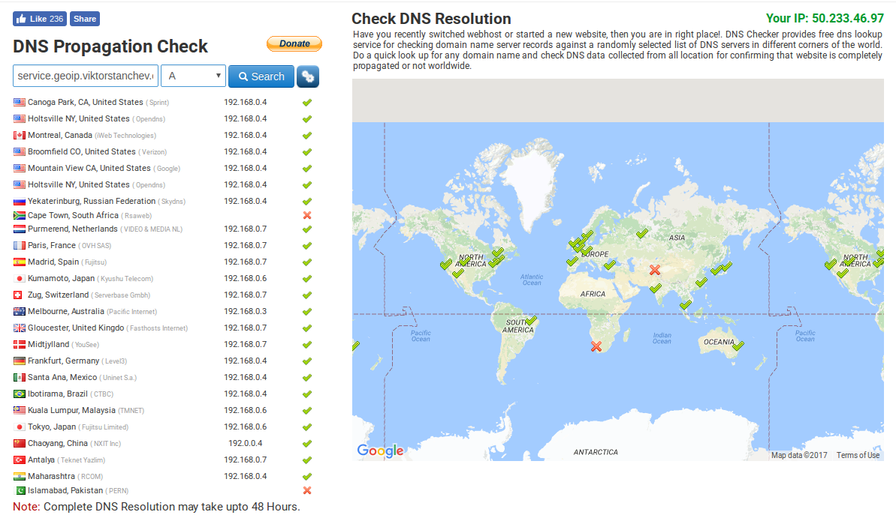

# pdns-geoip-example

The following will show you how to set up a basic DNS server that makes
decisions about how to respond based on the source ip of the query and a
geoip database. This is not meant to be a complete production-grade solution.
It's just an example that will cover the essentials. It's left as an exercise
for the reader to figure out how to adapt this example to their own environment.

First build the docker image with powerdns and the example configs baked in (or
pull viktorstanchev/pdns-geoip-example from docker hub):

```
make
```

Create a publicly accessible machine that will act as your nameserver.

Create a domain for your nameserver.
```
A ns1.viktrostanchev.com 34.209.175.83
```

Set up the nameserver for your domain to delegate queries for your subdomain to your geoip backed name server:
```
NS geoip.viktorstanchev.com ns1.viktorstanchev.com
```

Deploy the DNS server on the nameserver.
```
docker run --rm -it -p 53:53/udp --name dns viktorstanchev/pdns-geoip-example
```

Now you can query `service.geoip.viktorstanchev.com` from different continents and
get different results. An easy way to verify this is https://dnschecker.org/.
The DNS server with the example config will also respond with custom results for
queries coming from the subnets `172.31.0.0/16` and `172.32.0.0./16`, so you can
see how one would configure this.

To verify that the nameserver is working correctly locally you can use the following
commands:

```
docker network create --subnet 172.31.0.0/16 dnstest1
docker network create --subnet 172.32.0.0/16 dnstest2
docker run -d --name dns --net dnstest1 --ip 172.31.0.2 viktorstanchev/pdns-geoip-example
docker network connect --ip 172.32.0.2 dnstest2 dns

docker run --rm -it --net dnstest1 alpine sh -c 'apk add --no-cache drill && drill @172.31.0.2 service.geoip.viktorstanchev.com'
# example output:
# service.geoip.viktorstanchev.com.	30	IN	A	192.168.0.1
docker run --rm -it --net dnstest2 alpine sh -c 'apk add --no-cache drill && drill @172.32.0.2 service.geoip.viktorstanchev.com'
# example output:
# service.geoip.viktorstanchev.com.	30	IN	A	192.168.0.2
```

Example result from https://dnschecker.org:


